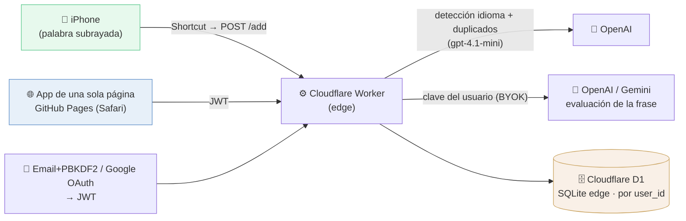

# Vocab — Portfolio Case Study

Live: [huellasenarena.github.io/vocab-app](https://huellasenarena.github.io/vocab-app) · Personal project → product · February 2026 – present · [Repo](https://github.com/huellasenarena/vocab-app)

This file contains, for portfolio use:
1. Short project card (ES + EN)
2. Architecture diagram (Mermaid + ASCII fallback)
3. Full case study (ES + EN)

---

## 1. Short project card

### 🇪🇸 Tarjeta corta

**Vocab** — App de práctica de vocabulario que entrena el **uso real** de las palabras, no solo reconocerlas. Subrayo una palabra en el móvil, ejecuto un atajo, y entra en mi lista (detección de idioma y de duplicados automática). Luego la practico escribiendo frases que una IA evalúa, con repetición espaciada (SM-2). Lo construí para preparar el DELE; después lo generalicé de herramienta personal a producto multiusuario: autenticación (Google + email), base de datos en el edge y **BYOK** (cada usuario usa su propia clave de IA, coste cero para el servidor).

`Cloudflare Workers` · `Cloudflare D1` · `JWT` · `Google OAuth` · `OpenAI` · `Gemini` · `iOS Shortcuts` · `JavaScript` · `GitHub Pages`

### 🇬🇧 Short card

**Vocab** — A vocabulary practice app that trains the **actual use** of words, not just recognizing them. I underline a word on my phone, run a Shortcut, and it lands in my list (automatic language + duplicate detection). Then I practice it by writing sentences that an AI evaluates, with spaced repetition (SM-2). I built it to prepare for the DELE exam; then I generalized it from a personal tool into a multi-user product: authentication (Google + email), an edge database, and **BYOK** (each user brings their own AI key — zero server cost).

`Cloudflare Workers` · `Cloudflare D1` · `JWT` · `Google OAuth` · `OpenAI` · `Gemini` · `iOS Shortcuts` · `JavaScript` · `GitHub Pages`

---

## 2. Architecture diagram

### Mermaid



### ASCII fallback

```
  📱 iPhone (palabra subrayada)        🌐 App de una página (Safari)
        │  Shortcut → POST /add               │  login Google / email → JWT
        │  (+ token personal)                 │
        ▼                                     ▼
                 ⚙️  Cloudflare Worker (edge)
                 auth JWT · BYOK · ruta /add
                          │
          ┌───────────────┼────────────────────┐
          ▼               ▼                     ▼
  🤖 OpenAI         🤖 OpenAI / Gemini    🗄️ Cloudflare D1
  detección idioma  evaluación de frase   (SQLite edge)
  + duplicados      (clave del usuario,   datos por user_id:
  (gpt-4.1-mini)     BYOK)                palabras · progreso · etc.

  >> Subrayar una palabra y tocar un atajo: eso es todo el "trabajo".
     La práctica entrena el USO, no el reconocimiento.
```

---

## 3. Full case study

### 🇪🇸 ESPAÑOL

## Vocab — práctica de vocabulario centrada en el uso real

**Proyecto personal → producto · Febrero 2026 – presente**

#### Resumen

*Vocab* es una app para aprender vocabulario practicando cómo se **usan** las palabras, no solo reconociéndolas. Cada palabra se practica escribiendo una frase propia que una IA evalúa (corrección lingüística + veredicto), dentro de un sistema de repetición espaciada. La empecé en febrero de 2026 para preparar el examen **DELE**, y la uso a diario. Después la transformé de herramienta personal en un **producto multiusuario** completo.

#### El problema

Me preparaba para el DELE y había acumulado una **lista enorme de palabras**. Pero las flashcards no son la mejor forma de integrar vocabulario al uso **activo**: puedes ver una palabra, entender su definición y aun así no saber emplearla. Además, mantener listas a mano consume tiempo y atención —justo lo que te aleja de practicar.

Quería dos cosas: **eliminar la fricción** de añadir palabras, y practicar el **uso real** en lugar del reconocimiento pasivo.

#### La solución: de la palabra subrayada a la práctica activa

1. **Capturar sin fricción.** Subrayo una palabra en el móvil y ejecuto un atajo de iOS. No escribo nada ni indico el idioma: el servidor detecta el idioma, valida que la palabra existe y descarta duplicados/variantes (conjugaciones, plurales) con un embudo de similitud + juez LLM.
2. **Practicar el uso.** La app me propone la palabra y **escribo una frase**. Una IA evalúa si la usé bien y analiza gramática/registro, con sugerencias. El objetivo no es reconocer la palabra: es **producirla** en una situación real.
3. **Repetición espaciada (SM-2).** Cada palabra se reprograma según mi rendimiento; un calendario me muestra qué toca revisar y cuándo.

Modos de práctica: espaciada, situación (recall activo), libre, e *imagen* (describir una foto con análisis por visión).

#### De herramienta personal a producto

Lo usaba mucho como proyecto personal, pero quería algo **más ambicioso para mi portfolio**, así que lo generalicé. Eso significó reconstruir el backend entero conservando un frontend de **una sola página**:

- **Autenticación** propia en el edge: email/contraseña (hash PBKDF2) **y** Google OAuth (verificación del ID token por JWKS RS256 en el Worker, con Web Crypto, sin librería de auth), sesiones por JWT.
- **Migración de Google Sheets a Cloudflare D1** (SQLite en el edge): cada tabla pasa a estar particionada por `user_id`. Reescribí ~25 llamadas de datos.
- **BYOK (Bring Your Own Key):** cada usuario introduce su propia clave de OpenAI/Gemini. La app nunca usa una clave compartida → **coste de IA cero** para el servidor, y la clave del dueño nunca queda expuesta. Las claves se sincronizan entre dispositivos vía D1.

#### Stack técnico

| Capa | Tecnología |
|---|---|
| Frontend | JavaScript vanilla, **un solo `index.html`**, HTML/CSS, mobile-first (Safari/PWA) |
| Hosting frontend | GitHub Pages (deploy vía GitHub Actions) |
| Backend / proxy | Cloudflare Worker (edge) |
| Base de datos | Cloudflare D1 (SQLite en el edge), multi-tenant por `user_id` |
| Autenticación | Email + PBKDF2 (Web Crypto) · Google OAuth (ID token, verificación JWKS RS256) · sesiones JWT (HS256) |
| IA (práctica) | **BYOK** — OpenAI (GPT) y Google (Gemma/Gemini), streaming, abstracción multi-proveedor |
| IA (captura) | `gpt-4.1-mini` server-side: detección de idioma, validez y similitud |
| Captura móvil | iOS Shortcuts → `POST /add` con token personal |

#### Retos técnicos resueltos

- **Autenticación desde cero en el edge:** PBKDF2 para contraseñas y verificación del **ID token de Google por JWKS (RS256)** dentro del Worker con Web Crypto, sin librerías. Vinculación de cuentas por email (un mismo email = una sola cuenta, ya entres con Google o con contraseña).
- **Migración Sheets → D1 sin perder el frontend de una página:** normalicé los datos a tablas relacionales por `user_id` y reescribí toda la capa de acceso, manteniendo la app en un único archivo.
- **BYOK con sincronización:** la clave viaja por cabecera en cada petición de IA y nunca se almacena del lado servidor por defecto; opción de sincronizarla (cifrada en reposo) entre los dispositivos del usuario.
- **Captura sin fricción con inteligencia server-side:** la ruta `/add` replica un embudo de validación —idioma + sentido + similitud (puntuación normalizada + juez LLM)— leyendo el vocabulario existente desde D1, y responde en el formato que el atajo de iOS ya entiende (mismas alertas «¿añadir de todas formas?»).
- **Evaluación de frases por IA:** veredicto estructurado + análisis lingüístico en streaming, con manejo de presupuestos de tokens de modelos de razonamiento y reglas anti-alucinación en los prompts.
- **Repetición espaciada (SM-2):** reprogramación por palabra, límite diario de palabras nuevas y cambio de día según la **hora local** del usuario.

#### Resultados

- **Uso diario desde febrero de 2026** para preparar el DELE; biblioteca personal de **8000+ palabras**.
- **Práctica del uso, no del reconocimiento:** escribo frases reales y recibo corrección inmediata.
- **Fricción de captura casi nula:** subrayar + un atajo, sin escribir ni indicar idioma.
- **De herramienta a producto en pocos días:** auth (Google + email), datos por usuario, BYOK y despliegue en producción, sin coste de IA del lado servidor.

#### Qué demuestra este proyecto

Construí solo un sistema full-stack de extremo a extremo —captura móvil, frontend, autenticación, base de datos en el edge e integración de varias APIs de IA— y, sobre todo, **transformé una necesidad personal real en un producto usable por otros**. Nació de aprender un idioma: la tecnología está al servicio de la práctica, automatizando lo aburrido (crear y mantener listas) para proteger lo que importa, **usar** las palabras.

El siguiente paso que más me interesa: **BYOK total** (que la captura de palabras también use la clave del propio usuario) e idiomas configurables, para que cualquiera pueda usarlo con su lengua.

---

### 🇬🇧 ENGLISH

## Vocab — vocabulary practice focused on real usage

**Personal project → product · February 2026 – present**

#### Overview

*Vocab* is an app for learning vocabulary by practicing how words are **used**, not just recognizing them. Each word is practiced by writing your own sentence that an AI evaluates (linguistic analysis + verdict), inside a spaced-repetition system. I started it in February 2026 to prepare for the **DELE** Spanish exam, and I use it daily. I then turned it from a personal tool into a full **multi-user product**.

#### The problem

I was preparing for the DELE and had built up a **huge list of words**. But flashcards aren't the best way to move vocabulary into **active** use: you can see a word, understand its definition, and still not know how to use it. On top of that, maintaining lists by hand costs time and attention — exactly what pulls you away from practicing.

I wanted two things: to **remove the friction** of adding words, and to practice **real usage** instead of passive recognition.

#### The solution: from an underlined word to active practice

1. **Frictionless capture.** I underline a word on my phone and run an iOS Shortcut. I type nothing and don't specify the language: the server detects the language, validates that the word is real, and discards duplicates/variants (conjugations, plurals) via a similarity funnel + LLM judge.
2. **Practice usage.** The app shows me the word and **I write a sentence**. An AI judges whether I used it correctly and analyzes grammar/register, with suggestions. The goal isn't to recognize the word — it's to **produce** it in a real situation.
3. **Spaced repetition (SM-2).** Each word is rescheduled based on my performance; a calendar shows what's due and when.

Practice modes: spaced, situation (active recall), free, and *image* (describe a photo with vision analysis).

#### From personal tool to product

I was using it heavily as a personal project, but I wanted something **more ambitious for my portfolio**, so I generalized it. That meant rebuilding the entire backend while keeping a **single-page** frontend:

- **Custom authentication at the edge:** email/password (PBKDF2 hashing) **and** Google OAuth (Google ID token verified via JWKS RS256 inside the Worker, with Web Crypto, no auth library), JWT sessions.
- **Migration from Google Sheets to Cloudflare D1** (edge SQLite): every table is now partitioned by `user_id`. I rewrote ~25 data calls.
- **BYOK (Bring Your Own Key):** each user enters their own OpenAI/Gemini key. The app never uses a shared key → **zero AI cost** on the server, and the owner's key is never exposed. Keys sync across devices via D1.

#### Tech stack

| Layer | Technology |
|---|---|
| Frontend | Vanilla JavaScript, **a single `index.html`**, HTML/CSS, mobile-first (Safari/PWA) |
| Frontend hosting | GitHub Pages (deployed via GitHub Actions) |
| Backend / proxy | Cloudflare Worker (edge) |
| Database | Cloudflare D1 (edge SQLite), multi-tenant by `user_id` |
| Authentication | Email + PBKDF2 (Web Crypto) · Google OAuth (ID token, JWKS RS256 verify) · JWT sessions (HS256) |
| AI (practice) | **BYOK** — OpenAI (GPT) and Google (Gemma/Gemini), streaming, multi-provider abstraction |
| AI (capture) | `gpt-4.1-mini` server-side: language detection, validity, similarity |
| Mobile capture | iOS Shortcuts → `POST /add` with a personal token |

#### Technical challenges solved

- **Auth from scratch at the edge:** PBKDF2 password hashing and **Google ID-token verification via JWKS (RS256)** inside the Worker with Web Crypto, no libraries. Account linking by email (same email = one account whether you sign in with Google or password).
- **Sheets → D1 migration without losing the single-page frontend:** normalized data into relational tables keyed by `user_id` and rewrote the whole data-access layer, keeping the app as one file.
- **BYOK with sync:** the key travels in a header on each AI request and is never stored server-side by default; an opt-in syncs it (encrypted at rest) across the user's devices.
- **Frictionless capture with server-side intelligence:** the `/add` route reproduces a validation funnel — language + sense + similarity (normalized scoring + LLM judge) — reading existing vocabulary from D1, and answers in the exact format the iOS Shortcut already understands (same "add anyway?" prompts).
- **AI sentence evaluation:** structured verdict + linguistic analysis, streamed, handling reasoning-model token budgets and anti-hallucination rules in the prompts.
- **Spaced repetition (SM-2):** per-word rescheduling, a daily new-word cap, and day boundaries based on the user's **local time**.

#### Results

- **Daily use since February 2026** to prepare for the DELE; a personal library of **8,000+ words**.
- **Practicing usage, not recognition:** I write real sentences and get immediate correction.
- **Near-zero capture friction:** underline + one Shortcut, no typing, no language tagging.
- **Tool to product in a few days:** auth (Google + email), per-user data, BYOK, and production deployment — with zero server-side AI cost.

#### What this project demonstrates

I built a complete end-to-end full-stack system alone — mobile capture, frontend, authentication, an edge database, and integration of several AI APIs — and, above all, **turned a real personal need into a product others can use**. It grew out of learning a language: technology serves the practice, automating the boring part (building and maintaining lists) to protect what matters — actually **using** the words.

The next step I'm most interested in: **full BYOK** (so word capture also uses the user's own key) and configurable languages, so anyone can use it with their own target language.
